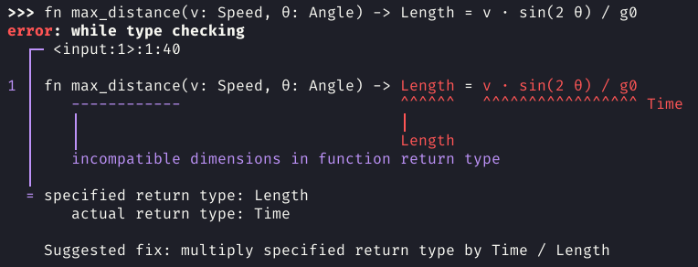

<div align="center">

<h1>Numbat</h1>

**[Features] • [Documentation] • [Tutorial] • [Syntax reference] • [Installation] • [Development]**


[Features]: #key-features
[Documentation]: https://numbat.dev/doc/
[Tutorial]: https://numbat.dev/doc/tutorial.html
[Syntax reference]: https://numbat.dev/doc/example-numbat_syntax.html
[Installation]: #installation
[Development]: #development

*Numbat* is a statically typed programming language for scientific computations<br>
with first class support for physical dimensions and units.

</div>

## Key features


*Click to learn more.*

<details>
<summary>
<b>Physical dimensions as types</b>
</summary>
<p></p>

Numbat has a static type system where physical dimensions like `Length` and `Time` *are* types.
Definitions of constants and functions can optionally contain type annotations that will be statically enforced.
If the types are not specified, they will be inferred (`Speed`, `Money` and `Frequency` in the screenshot).

See [this article](https://numbat.dev/doc/type-system.html) to learn more about Numbats type system.
</details>

<details>
<summary>
<b>Comprehensive standard library</b>
</summary>
<p></p>

Numbats [standard library](https://numbat.dev/doc/prelude.html) comes with a large number of physical dimensions and units (SI, US Customary, Imperial, Nautical, Astronomical, Atomic, Nuclear, …).
See [this reference page](https://numbat.dev/doc/list-units.html) for a complete overview.
It also contains a lot of [mathematical and physical constants](https://numbat.dev/doc/list-constants.html)
as well as a large range of [pre-defined functions](https://numbat.dev/doc/list-functions.html).
</details>

<details>
<summary>
<b>Strict syntax</b>
</summary>
<p></p>

Numbats parser never tries to be "smart" on syntactically incorrect input.
This means you will either get a (descriptive) error message, or you can trust the result of your calculation.
</details>

<details>
<summary>
<b>Excellent error messages</b>
</summary>
<p></p>

Numbat aims to provide descriptive and helpful error messages:

</details>

<details>
<summary>
<b>Focus on interactive use</b>
</summary>
<p></p>

Numbat has been designed for an interactive use-case with small "one off" computations. In the [REPL](https://en.wikipedia.org/wiki/Read%E2%80%93eval%E2%80%93print_loop),
you get a familiar readline interface with the usual features like a command history, Ctrl-R search and tab completion.
</details>

<details>
<summary>
<b>Modular and customizable</b>
</summary>
<p></p>

The whole system of physical dimensions and units is specified Numbats standard library, which is
[written in the Numbat language](https://github.com/sharkdp/numbat/tree/master/modules). It is therefore
easily extensible by [providing a `init.nbt` file](https://numbat.dev/doc/cli-customization.html).
Users can even choose to write their own `prelude` module, allowing for arbitrary modifications to the
unit system.

</details>

## Installation


## Development

Run Numbat CLI
```
cargo run -- <numbat args>
```

Install the CLI version
```
cargo install -f --path numbat-cli
```

Run all tests
```
cargo test
```
