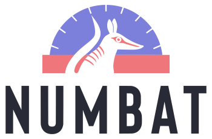
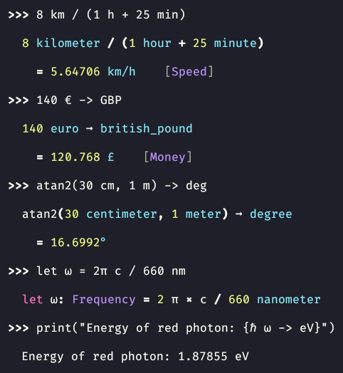

<div align="center">



**[Try online!] • [Documentation] • [Tutorial] • [Syntax reference] • [Installation] • [Discord] • [Development]**

[Try online!]: https://numbat.dev/
[Features]: #key-features
[Documentation]: https://numbat.dev/doc/
[Tutorial]: https://numbat.dev/doc/tutorial.html
[Syntax reference]: https://numbat.dev/doc/example-numbat_syntax.html
[Installation]: https://numbat.dev/doc/cli-installation.html
[Discord]: https://discord.gg/kAaVTsat4D
[Development]: #development

*Numbat* is a statically typed programming language for scientific computations<br>
with first class support for physical dimensions and units.

</div>

## Key Features



*Click to learn more.*

<details>
<summary>
<b>Physical dimensions as types</b>
</summary>
<p></p>

Numbat has a static type system where physical dimensions like `Length` and `Time` act as types.
Definitions of constants and functions can optionally contain type annotations that will be statically enforced.
If the types are not specified, they will be inferred (`Speed`, `Money` and `Frequency` in the screenshot).

See [this article](https://numbat.dev/doc/type-system.html) to learn more about Numbat's type system.
</details>

<details>
<summary>
<b>First-class physical units</b>
</summary>
<p></p>

Numbat is focused on computations with units. Units are therefore treated as first-class citizens. They can be
[entered in various ways](https://numbat.dev/doc/unit-notation.html) (`km/h` or `kilometer/hour`, `GiB` or
`gibibytes`, `°` or `degree`, `m²` or `m^2`).
New units can be [introduced](https://numbat.dev/doc/unit-definitions.html) on the spot (`unit pixel`).
Compatible units can be converted easily [using the `->` operator](https://numbat.dev/doc/unit-conversions.html) (`30 km/h -> mph`, `1 mrad -> degree`, `5 in + 2 ft -> cm`, `27 weeks -> days`).
And unit expressions are simplified using various heuristics (`15 km/h * 30 min = 7.5 km`).
</details>

<details>
<summary>
<b>Comprehensive standard library</b>
</summary>
<p></p>

Numbat's [standard library](https://numbat.dev/doc/prelude.html) comes with a large number of physical dimensions and units (SI, US Customary, Imperial, Nautical, Astronomical, Atomic, Nuclear, …).
See [this reference page](https://numbat.dev/doc/list-units.html) for a complete overview.
It also contains a lot of [mathematical and physical constants](https://numbat.dev/doc/list-constants.html)
as well as a large range of [pre-defined functions](https://numbat.dev/doc/list-functions.html).
</details>

<details>
<summary>
<b>Strict syntax</b>
</summary>
<p></p>

Numbat's parser never tries to be "smart" on syntactically incorrect input.
This means you will either get a (descriptive) error message, or you can trust the result of your calculation.
</details>

<details>
<summary>
<b>Excellent error messages</b>
</summary>
<p></p>

Numbat aims to provide [descriptive and helpful error messages](https://github.com/sharkdp/numbat/blob/master/assets/numbat-error.png).
</details>

<details>
<summary>
<b>Interactive terminal</b>
</summary>
<p></p>

Numbat has been designed for an interactive use-case with small "one off" computations. Opening the `numbat` interpreter
without any arguments starts a [REPL](https://en.wikipedia.org/wiki/Read%E2%80%93eval%E2%80%93print_loop) with a familiar
readline interface, including all the usual features like a command history, Ctrl-R search or tab completion.
</details>

<details>
<summary>
<b>Modular and customizable</b>
</summary>
<p></p>

The whole system of physical dimensions and units is specified Numbat's standard library, which is
[written in the Numbat language](https://github.com/sharkdp/numbat/tree/master/numbat/modules) itself. It is therefore
easily extensible by [providing a `init.nbt` file](https://numbat.dev/doc/cli-customization.html). For example,
a single line (`unit bathtub = 150 L`) is usually enough to add a new unit. Users can even choose to write their
own `prelude` module, allowing for arbitrary modifications to the unit system.
</details>

<details>
<summary>
<b>Assertions</b>
</summary>
<p></p>

With its static type system, Numbat already enforces correctness of your calculations on a physical dimension level.
But some checks can only be made at runtime. Numbat provides an `assert_eq` procedure that allows you to check for
exact equality using `assert_eq(12 ft, 1 in)` or approximate equality using `assert_eq(c, 300_000 km/s, 1% × c)`.
This can be useful to make sure that intermediate results do not change during a restructuring of your calculation.
</details>

<details>
<summary>
<b>Non-features</b>
</summary>
<p></p>

Numbat is a scientific calculator. It's not a computer algebra system that solves differential equations
or computes intergrals. Try [WolframAlpha](http://www.wolframalpha.com/) instead.<br>
There is no graphical user interface with buttons like `x²`, `1/x` or `DEG/RAD`.
[Qalculate!](http://qalculate.github.io/) is a fantastic tool that supports both text as well as graphical
input.<br>
Numbat supports a huge range of physical units. If you need something even more comprehensive,
please consider contributing. Or try [GNU units](https://www.gnu.org/software/units/).
</details>

<p>&nbsp;</p>
<p>&nbsp;</p>
<p>&nbsp;</p>
<p>&nbsp;</p>

## Installation

See [this page](https://numbat.dev/doc/cli-installation.html) for details on how to install the native command-line version of Numbat.

## Development

[](https://github.com/sharkdp/numbat/actions/workflows/ci.yml)

Run Numbat CLI
```
cargo run -- <numbat args>
```

Install the CLI version
```
cargo install -f --path numbat-cli
```

Run all tests
```
cargo test
```

### Working on the `prelude`

If you are working on [Numbat's standard library](numbat/modules/), it is convenient to point
the `NUMBAT_MODULES_PATH` environment variable to the `numbat/modules/` folder. This way,
you don't have to recompile Numbat to see your changes.

Alternatively, you can create a symlink from `~/.config/numbat/modules` to the `numbat/modules/`
folder in the repository (see [this page](https://numbat.dev/doc/cli-customization.html#module-paths)
for the standard paths on other operating systems).

## Contact us

This project is maintained by [David Peter](https://github.com/sharkdp) and [Mads M. Jensen](https://github.com/Goju-Ryu).
To contact us, either [open a GitHub issue](https://github.com/sharkdp/numbat/issues/new/choose)
or [discussion](https://github.com/sharkdp/numbat/discussions), or pop into our
[Discord server](https://discord.gg/kAaVTsat4D).
