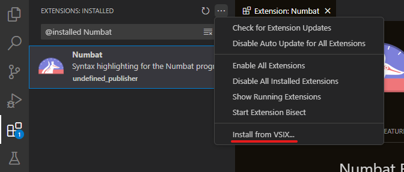

# Numbat README

The Numbat extension provides language support for the [Numbat](https://github.com/sharkdp/numbat) programming language.

## Features

- Syntax highlighting
- Code block folding
- comment toggling
- autosurrounding brackets

## Installation

To install this extension you will need to download the extension installation file (VSIX file), which can be found in the assets of each [numbat release](https://github.com/sharkdp/numbat/releases) after v1.15.0.  
Once the VSIX file has been downloaded, open visual studio code and go to the _Extensions_ tab of the sidebar. Click the three dots in the upper right corner of the tab and chose the _"Install from VSIX..."_ option. Find the VSIX file via the file picker and select it to install it.

## Requirements

_None_  

## Extension Settings

_None_  

## Known Issues

_None so far_  

## Release Notes

### 0.1.0

Initial release of the Numbat extension!
